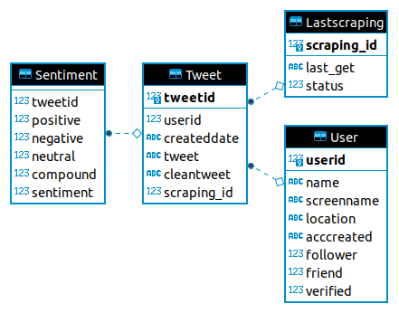

# sentiment-analysis-module

Modul analisis sentimen yang dikembangkan dengan Python 3

Package yang dibutuhkan:

- tweepy
- nltk
- jupyter notebook/ anaconda

Database dikembangkan dengan SQLite 3


### Konfigurasi _file_ config.py

Untuk dapat menjalankan modul ini, silahkan buat _file_ config.py pada direktori proyek ini, lalu buatlah kode Python sebagai berikut

```python
api_public = '...' # API Key
api_private = '...' # API Key Secret
access_public = '...' # Access Token
access_private = '...' # Access Token Secret
```

Silahkan ganti tanda ... dengan kode API dan _Access Token_ akun _Twitter Developer_ Anda. Tetap gunakan tanda petik karena kode _Access Token_ dan API harus bertipe _string_.


### Pengaturan _Database_

Untuk memasukkan _database_, silahkan masukkan direktori database SQLite3 Anda pada variabel DATABASE_DIR main.py. 

_Database_ yang dapat digunakan pada proyek/ modul ini adalah yang memiliki struktur sebagai berikut:



Tersedia juga _file_ sqlite3_Init.sql (SQLite 3) dan pgsql_init.sql (Postgresql) untuk membuat _database_ kosong dengan struktur seperti gambar di atas. Silahkan eksekusi _file_ .sql tersebut dengan _DB browser_ (DBeaver, dll) atau dengan menggunakan terminal dengan perintah sebagai berikut (misal nama _database_ baru adalah "NewDatabase.db"):


##### Sqlite 3

Linux/ MacOS

```bash
sqlite3 NewDatabase.db ".read databaseInit.sql"
```

Windows

```bash
sqlite3.exe NewDatabase.db ".read databaseInit.sql"
```


##### PostgreSQL

Linux/ MacOS

```bash
psql -U (username postgre Anda) -d NewDatabase -f pgsql_init.sql
```


### Menjalankan Modul

Untuk menjalankan modul, gunakan perintah berikut:


Python 3

```python
python3 main.py [argumen]
```


Argumen dapat diganti dengan angka yang menyatakan banyaknya _tweet_ yang ingin diambil. Jika argumen kosong, maka main.py akan mengambil 50 _tweet_.


### Pengaturan main.py

##### 1. Tanggal _tweet_

Tanggal _tweet_ dapat diubah pada variabel `tweet_date`. Silahkan ubah dalam isi variabel ini dalam format YYYY-mm-dd dengan tipe data _string_.

##### 2. Kata kunci pencarian

Kata kunci pencarian (dalam bentuk kata, _hashtag_, dll) dapat diubah dalam variabel `keywords`. Isi variabel `keywords` adalah _list_ Python yang setiap elemennya adalah _string_.

##### 3. Kueri pencarian

Pada variabel `filters`, Anda dapat mengubah nilainya menjadi kueri lanjutan seperti pada [petunjuk berikut](https://unionmetrics.com/resources/how-to-use-advanced-twitter-search-queries/).  Variabel `query` akan menggabungkan semua nilai `keywords` dan `filters` menjadi satu _string_ kata kunci untuk scrapping data _tweet_.


### _Credits_

Langkah-langkah membuat basis data dan algoritma program pada modul ini disusun oleh pihak Sanbercode kelas Analisis Opini Publik.